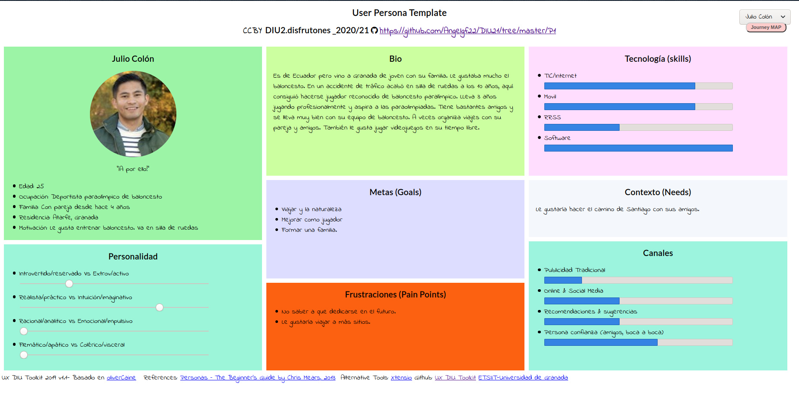

## DIU - Practica1, entregables

DIU2 - DISFRUTONES

Ángel Gómez Ferrer
Cristian Fernández Jiménez
https://github.com/Angelgf22/DIU21/tree/master/P1

# Competitive Analysis:

# Personas:

## Julio Colón

## Isabel Pérez

# Journey Map:

## Julio Colón

## Isabel Pérez

# Usability review

Puntuación: 79

La página elegida es una gran opción para el turismo gallego, presenta un cómodo y vistoso diseño y abarca gran cantidad de aspectos. Además, está disponible en 10 idiomas distintos e incluso posibilita una opción auditiva. Cuenta con una aplicación móvil, por lo que será más sencillo para el usuario consultarla durante el viaje.
Sin embargo, presenta elevados tiempos de carga, aún así cuenta con feedback en este tipo de situación; no cuenta con ayuda en línea y en algunos casos la información es más extensa de lo que debería, pero aún así dispone de un abanico más que suficiente de posibilidades para hacer turismo en Galicia. 
Turismo.gal presenta una gran accesibilidad para los distintos usuarios y nivel de
experiencia, además de un diseño conciso e intuitivo.
