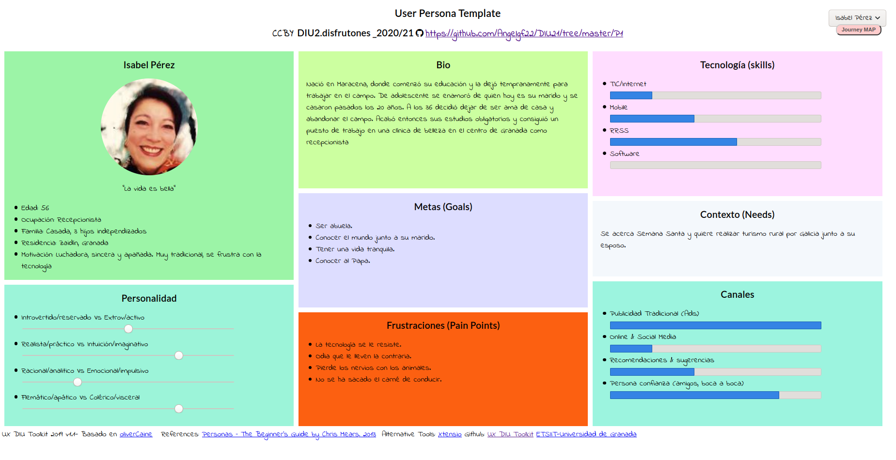

## DIU - Practica1, entregables

DIU2 - DISFRUTONES

Ángel Gómez Ferrer
Cristian Fernández Jiménez
https://github.com/Angelgf22/DIU21/tree/master/P1

# Competitive Analysis:

# Personas:

## Julio Colón

## Isabel Pérez

# Journey Map:

## Julio Colón

## Isabel Pérez

# Usability review

Puntuación: 79

Turismo.gal cuenta con una gran accesibilidad para los distintos usuarios y nivel de
experiencia, además de un diseño conciso e intuitivo.
