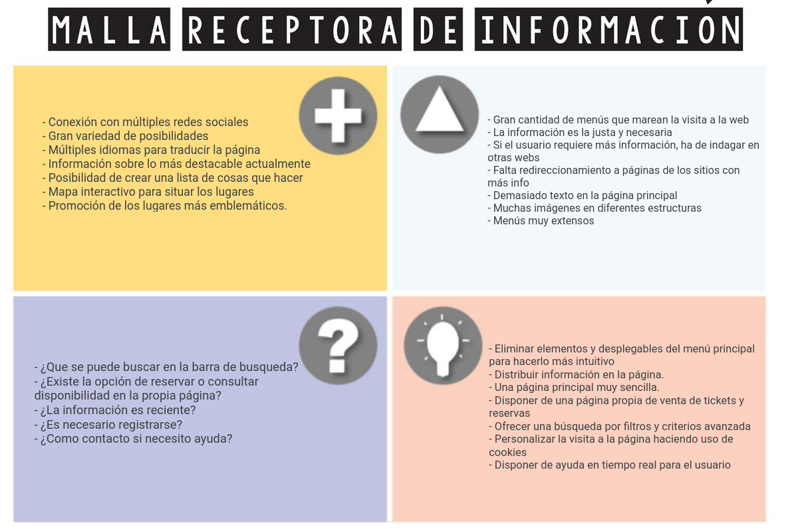
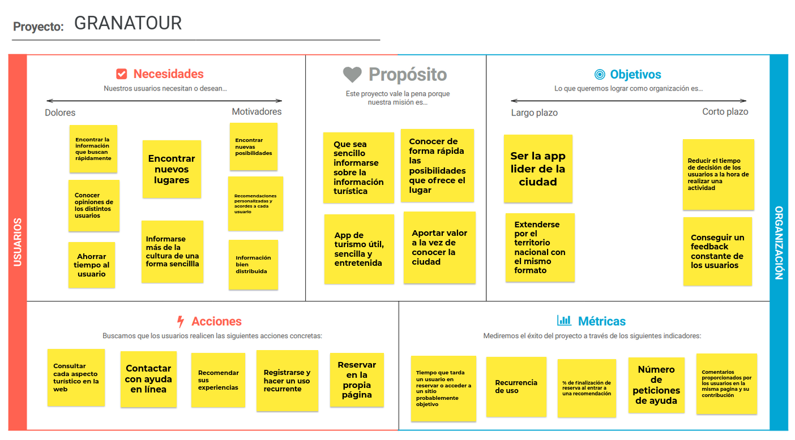
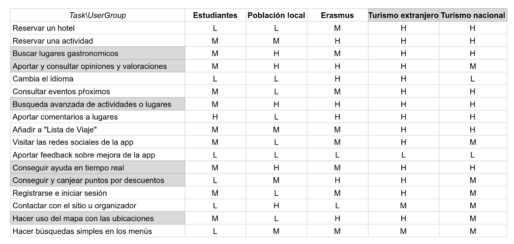
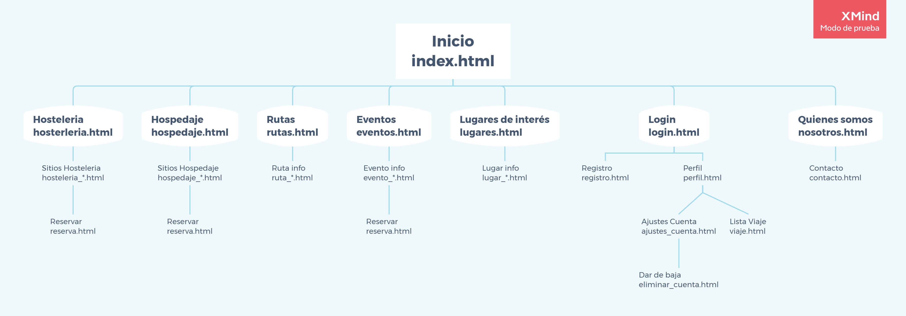
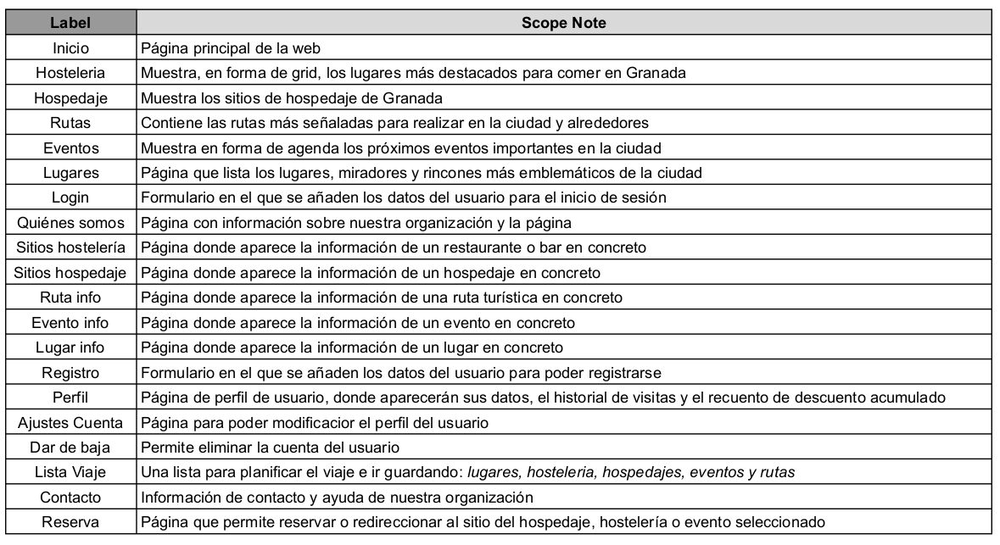

## DIU - Practica2, entregables

### Ideación 
* Malla receptora de información 

### PROPUESTA DE VALOR
* GRANATOUR

Diseñaremos una app web institucional para el turismo en Granada. Habilitaremos el registro de los usuarios, además de la posibilidad de realizar compras en la propia página web. Además será una página muy visual e interactiva, contando con descuentos según colectivo social. Al ser recurrentes en el uso de la web, se ganarán puntos canjeables por descuentos y distintas ofertas relacionadas. Además se ofrecerá información concisa, real y bien distribuida de los lugares y eventos a visitar más demandados en cada momento, con la posibilidad de dejar las experiencias de cada usuario. 
Los menús serán simples y sencillos, evitando crear decenas de divisiones innecesarias.
Las búsquedas serán por filtros de distintos tipos y basados en lo que al usuario le pueda agradar, contando además con un mapa.
La página se actualizará haciendo uso de cookies y en base a la experiencia de usuario.
Por último se dispondrá de ayuda en tiempo real para los usuarios que la necesiten.

### TASK ANALYSIS

* User Task Matrix 

### ARQUITECTURA DE INFORMACIÓN

* Sitemap 

* Labelling 

### Prototipo Lo-FI Wireframe 

### Conclusiones  
(incluye valoración de esta etapa)
