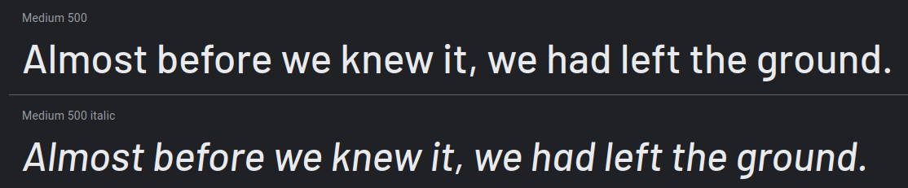
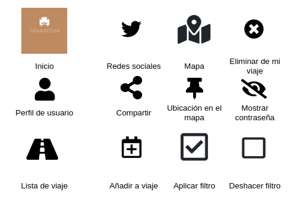

# DIU - Practica 3, entregables

## Moodboard (diseño visual + logotipo)   

## Landing Page

## Guidelines

En cuanto a las fuentes, hemos optado por Barlow. 
Se trata de un diseño sencillo y elegante, que utilizaremos en negrita e italic para resaltar la información más importante.

Los iconos son simples y muy facil de reconocer, para posibilitar el fácil uso de la aplicación y agrado.

En nuestro caso, hemos optado por una paleta con tonos marrones y pálidos, que recuerdan a los distintos tonos que puede tener la Alhambra de Granada, en sus diferentes zonas y con el paso de los años. 
La intención es la comodidad de los visitantes y el confort visual.

Por último, acomodamos estos factores al Logo de nuestra APP o Página, con un pequeño icono del Patio de los Arrayanes de la Alhambra de Granada.
Así se logra una conexión directa con la finalidad de la aplicación.

### Patrones UI
En cuanto a patrones se han diseñado páginas que cumplen con los siguientes:

- Login y Registro: Página inicial donde ha de registrarse con una red social ó iniciar sesión.
- Marcadores y favoritos: Posibilidad de añadir lugares a Mi lista de viaje.
- Detalles de contenido: Información específica de los lugares.
- Mapas: Localización detallada del lugar en cuestión.
- Sugerencias: Link a lugares recomendados.
- Comentarios: Posibilidad de escribir y leer comentarios.
- Información sobre la empresa: Información sobre la aplicación en cuestión en ¿Quiénes somos?
- Ayuda y retroalimentación: Añadido de ayuda en ¿Necesitas ayuda?
- Filtrar y ordenar: Filtro y ordenación de búsquedas.
- Perfil y cuenta: Perfil de usuario y ajustes de este.
- Compartir: Posibilidad de compartir los lugares.

## Mockup: LAYOUT HI-FI
* Página de Inicio de Sesión y Registro

* Página principal

* Menú lateral desplegable

* Búsqueda 

* Página de ejemplo de sitio

## Documentación: Publicación del Case Study

La explicación se encuentra [aquí](https://www.youtube.com/watch?v=kpB3Zgwq-bg).
