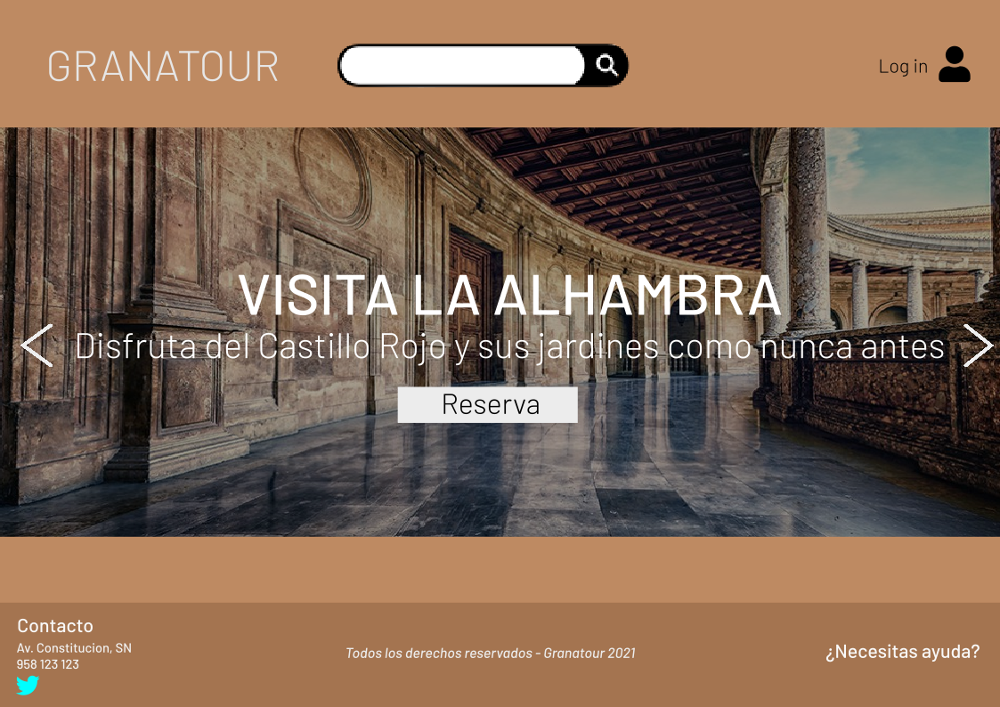
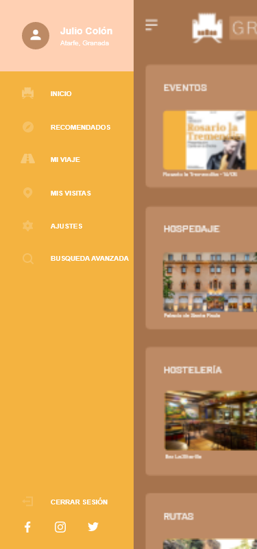

# DIU - Practica 3, entregables

## Moodboard (diseño visual + logotipo)   

## Landing Page

## Guidelines

En cuanto a las fuentes, hemos optado por Barlow. 
Se trata de un diseño sencillo y elegante, que utilizaremos en negrita e italic para resaltar la información más importante.

Los iconos son simples y muy facil de reconocer, para posibilitar el fácil uso de la aplicación y agrado.

En nuestro caso, hemos optado por una paleta con tonos marrones y pálidos, que recuerdan a los distintos tonos que puede tener la Alhambra de Granada, en sus diferentes zonas y con el paso de los años. 
La intención es la comodidad de los visitantes y el confort visual.

Por último, acomodamos estos factores al Logo de nuestra APP o Página, con un pequeño icono del Patio de los Arrayanes de la Alhambra de Granada.
Así se logra una conexión directa con la finalidad de la aplicación.

## Mockup: LAYOUT HI-FI

## Documentación: Publicación del Case Study

(incluye) Valoración del equipo sobre la realización de esta práctica o los problemas surgidos
 
