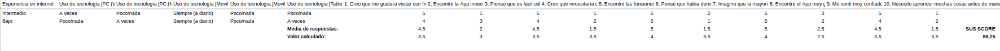
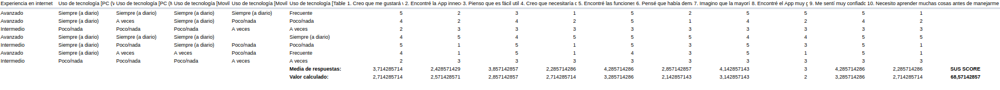

# DIU - Practica 4, entregables

 4.a Caso asignado
----

Aplicación que permitar realizar itinerarios de viajes personalizados, permitiendo a los usuarios guardar documentos, imágenes y videos relacionadas con el mismo, así como estimar un saldo común para su viaje.

 4.b User Testing
----
 

| Usuarios | Sexo/Edad     | Ocupación   |  Exp.TIC    | Tirada de dados | Plataforma | TestA/B
| ------------- | -------- | ----------- | ----------- | -----------  | ---------- | ----
| Fernando  | H / 53   | Albañil  | Media       | Discapacitado/Planificador/Disgustado | Móvil/Web.       | A 
| Juan  | H / 21   | Estudiante  | Avanzada       | Trabajador/Fiesta/Furioso       | Móvil/Web/Windows        | B 
| Pedro  | H / 21   | Trabajador sector secundario     | Amigos/Fiestero/Sorprendido        | Fiestero    | Móvil/Web/Windows      | B 
| María  | M / 58   | Ama de casa  | Baja       | Familia/Deporte/Asustada     | Móvil        | A

Tras la tirada de dados, hemos realizado los cuestionarios y mandado a personas reales que se adaptaban a estas tiradas

. 4.c Cuestionario SUS
----

Hemos generado dos cuestionarios para el caso [A](https://docs.google.com/forms/d/e/1FAIpQLSeJthlhAz1rKSFYXng3PKeYyweU-23RLJolVWizjdc4axrgeA/viewanalytics) y [B](https://docs.google.com/forms/d/e/1FAIpQLSdDtSrK6NUaRZnXMgiEZIoMw9W2Wr_Mv-v3u343IFkT6sZmog/viewanalytics), y han sido contestados por personas que se adecúan a los usuarios comentados anteriormente.

A continuación hemos obtenido las puntuaciones SUS con la media de las respuestas para cada prototipo:

A: 86,25 
[Excel](https://github.com/Angelgf22/DIU21/blob/master/P4/Caso%20A%20(respuestas).xlsx)

B: 68,57142857 
[Excel](https://github.com/Angelgf22/DIU21/blob/master/P4/Caso%20B%20(respuestas).xlsx)

En cuanto a valoración del caso B (Navis), hemos de decir que la nota obtenida por las valoraciones de las personas puede deberse al exceso de simpleza de la aplicación. Esto es bueno hasta cierto punto, sin embargo, para una aplicación de viajes se necesita un mínimo de complejidad a la hora de realizar búsquedas mediante filtros y fechas. Probablemente los compañeros lo hayan planteado pero no se hayan centrado en ello en los Mockups. En cuanto a diseño de colores e iconos está acertado, puesto que son colores atractivos y que invitan a permanecer en la aplicación, aunque quizás son poco originales porque recuerdan a páginas como Ryanair o Skyscanner.

 4.d Usability Report 
----

La review del Case of Study de Salsoteca que hemos realizado se puede ver [aquí](https://github.com/Angelgf22/DIU21/blob/master/P4/UXCaseStudy-Salsoteca.xls)

El report de usbailidad para la práctica B es el siguiente: [aquí](https://github.com/Angelgf22/DIU21/blob/master/P4/DIU_report-Navis-usability-test.pdf)

>>> Valoración personal 
Como conclusión creemos que sería correcto decir que todos los participantes consideraron la interfaz intuitiva, fácil de usar y algo a lo que estamos acostumbrados a ver y utilizar normalmente siendo de esta forma algo poco complejo y para lo que no necesitamos conocimientos previos de ningún tipo; sin embargo como ya se ha comentado sobre los resultados de las preguntas realizadas a los participantes, se podrían destacar como aspectos a mejorar: la longitud que pueda tener al recorrerlo (aunque este aspecto quizás no se pueda apreciar muy correctamente desde la experiencia visual que se proporciona a los usuarios), también la falta de consistencia en la App muy probablemente debido a la falta de información escrita y el hecho de no rellenar toda la pantalla con contenido pueden ser negativos visualmente, puesto que no se aprovecha el espacio de la pantalla.

Añadir que la aplicación es a rasgos generales simple e intenta ir por la corriente del minimalismo, esto es muy bueno hasta cierto punto en el que quizás pueda hacer que no sea suficientemente intuitivo debido a la falta de información.

Por último comentar desde el punto de vista de la apariencia, la paleta de colores e iconos que se han elegido para la aplicación son acertados.

