# DIU21
Prácticas Diseño Interfaces de Usuario 2020-21 (Tema: Turismo) 

Grupo: DIU2_DISFRUTONES.  Curso: 2020/21 
Updated: 17/3/2021

Proyecto: 
 Granatour

Descripción: 

Diseñaremos una app web institucional para el turismo en Granada. Habilitaremos el registro de los usuarios, además de la posibilidad de realizar compras en la propia página web. Además será una página muy visual e interactiva, contando con descuentos según colectivo social. Al ser recurrentes en el uso de la web, se ganarán puntos canjeables por descuentos y distintas ofertas relacionadas. Además se ofrecerá información concisa, real y bien distribuida de los lugares y eventos a visitar más demandados en cada momento, con la posibilidad de dejar las experiencias de cada usuario. 
Los menús serán simples y sencillos, evitando crear decenas de divisiones innecesarias.
Las búsquedas serán por filtros de distintos tipos y basados en lo que al usuario le pueda agradar, contando además con un mapa.
La página se actualizará haciendo uso de cookies y en base a la experiencia de usuario.
Por último se dispondrá de ayuda en tiempo real para los usuarios que la necesiten.

Logotipo: 

Miembros
 * :bust_in_silhouette: [Ángel Gómez Ferrer](https://github.com/Angelgf22) :octocat:     
 * :bust_in_silhouette:  [Cristian Fernández Jiménez](https://github.com/crisfj00) :octocat:

----- 

# Proceso de Diseño 

## Paso 1. UX Desk Research & Analisis 

 1.a Competitive Analysis
-----

Principalmente analizamos páginas de turismo nacional como son esmadrid, turgranada, granadatur, turismo.gal, turismocantabria y turismoasturias ya que eran las propuestas en la misma práctica, de entre todas estas analizamos si contaban con apartados que consideramos de importancia, a la hora de diseñar una página con esta funcionalidad como puede ser si cuenta con:

- Un apartado que abarca toda posible actividad turística.
- Que permitiera guardar lugares y sitios para poder listarlos perosnalmente.
- Información concreta de cada lugar a visitar con referencias a su propia página web.
- Lugares con un enlace a compra de entradas...
- Existencia de un mapa que situara lugares a partir de distintos filtros.
- Cuenta con una aplicación móvil.
- Redes sociales asociadas.
- Grandes fallos percibidos de las mismas.

De esas páginas concluimos que la que mejor cumplia estos puntos era turismo.gal.

La seleccionamos ya que al ser una página del gobierno autonómico, requiere la máxima perfección, y además se centra en toda la comunidad y no solo una única ciudad.

 1.b Persona
-----

## Julio Colón
La primera persona elegida (Julio) es un perfil de una persona dicapacitada, la cual quiere hacer un viaje con sus amigos, que no se lleva mal con la tecnología; sin embargo a veces se da el caso de que no se presenta una opción para estas personas (que no se tienen en cuenta) o bien la información que se les proporciona no es muy amplia.

## Isabel Pérez
La segunda persona elegida (Isabel) es un perfil bastante común, una persona adulta en torno a 50~ años, sin mucho conocimiento sobre la tecnología y por tanto le puede costar orientasrse.

Los hemos escogido porque nos parecía interesante empatizar más a fondo con estas situaciones y acercarnos más a sus puntos de vista.

 1.c User Journey Map
----

Como primera experiencia hemos supuesto que Julio quiere hacer el Camino de Santiago adaptado a su condición, es por ello que buscará información y exigirá a la página lo suficiente para poder planearlo por completo.  

En el segundo caso Isabel quiere organizar una escapada rural a Galicia en Semana Santa, pero es la primera vez que intenta reservar algo así desde internet, por lo que requiere una página simple y con todo lo necesario para poder realizar la experiencia.  

Consideramos estas experiencias muy frecuentes, aunque traten aspectos bastante inusuales.

 1.d Usability Review
----

 - Enlace al documento:  [PDF](P1/Usability-review-TURISMOGAL.pdf)
 - Valoración final (numérica): 79
 - Como era de esperar la valoración obtenida es alta, es una página con un buen diseño, muchisima accesibilidad y prácticamente cumple de sobra con los requisitos evaluados, como se puede notar el mayor problema que podemos percibir y notamos desde el analisis competitivo de la misma es el tiempo de carga que proporciona; sin embargo los demás puntos a evaluar son más que notables.

## Paso 2. UX Design  

 2.a Feedback Capture Grid / EMpathy map / POV
----

  
    
Propuesta de valor:

Diseñaremos una app web institucional para el turismo en Granada. Habilitaremos el registro de los usuarios, además de la posibilidad de realizar compras en la propia página web. Además será una página muy visual e interactiva, contando con descuentos según colectivo social. Al ser recurrentes en el uso de la web, se ganarán puntos canjeables por descuentos y distintas ofertas relacionadas. Además se ofrecerá información concisa, real y bien distribuida de los lugares y eventos a visitar más demandados en cada momento, con la posibilidad de dejar las experiencias de cada usuario. 
Los menús serán simples y sencillos, evitando crear decenas de divisiones innecesarias.
Las búsquedas serán por filtros de distintos tipos y basados en lo que al usuario le pueda agradar, contando además con un mapa.
La página se actualizará haciendo uso de cookies y en base a la experiencia de usuario.
Por último se dispondrá de ayuda en tiempo real para los usuarios que la necesiten.

 2.b ScopeCanvas
----

 2.b Tasks analysis 
-----

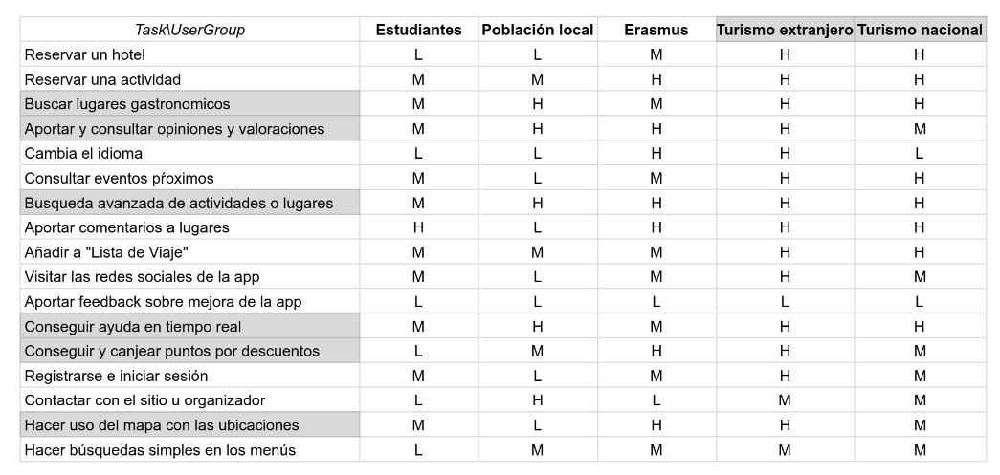 

 2.c IA: Sitemap + Labelling 
----

* Sitemap

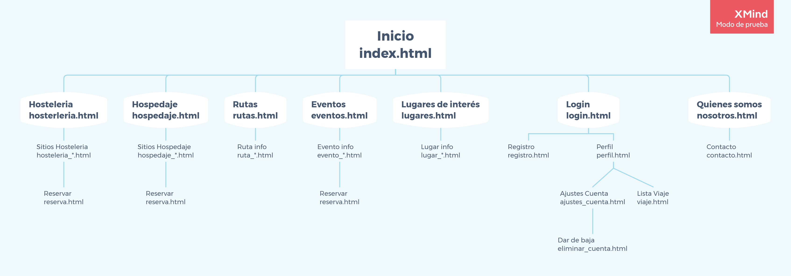

* Sitemap Info

* Labelling

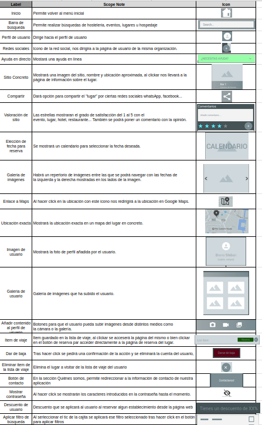

  

 2.d Wireframes
-----
### Prototipo Lo-FI Wireframe 

* Granatour - Página principal

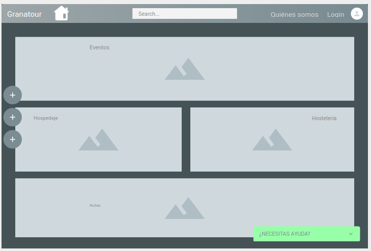

* Hostelería

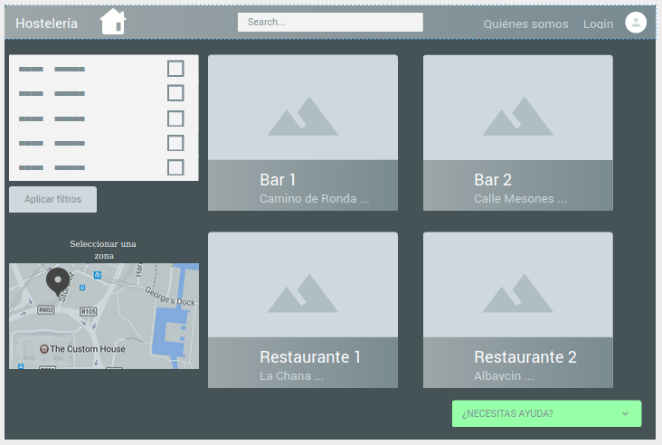

* Sitio Hosteleria

* Reserva (Usada en Hosteleria, Hospedaje y Eventos)

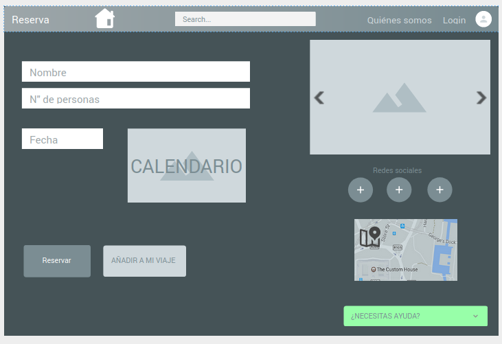

* Hospedaje

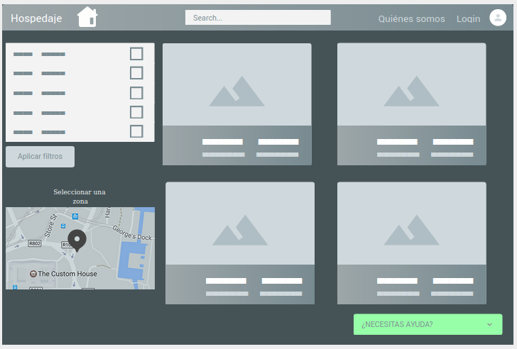

* Sitio Hospedaje

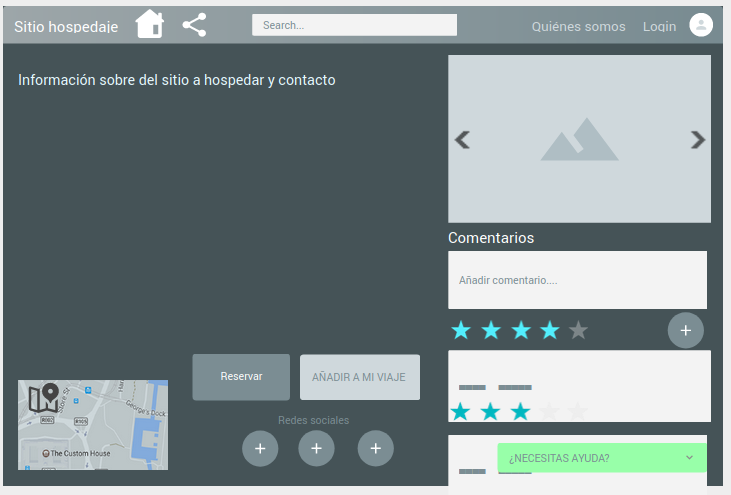

* Rutas

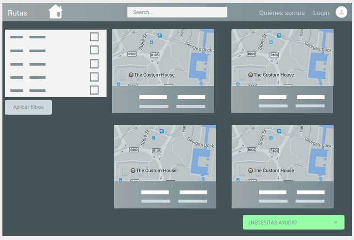

* Ruta info

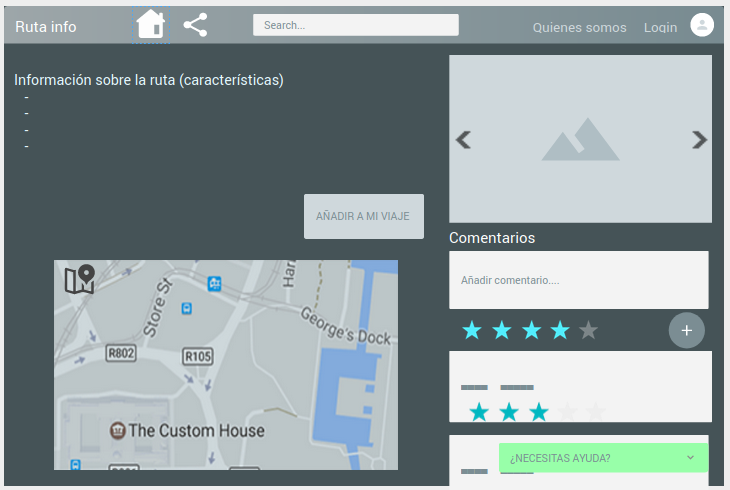

* Eventos

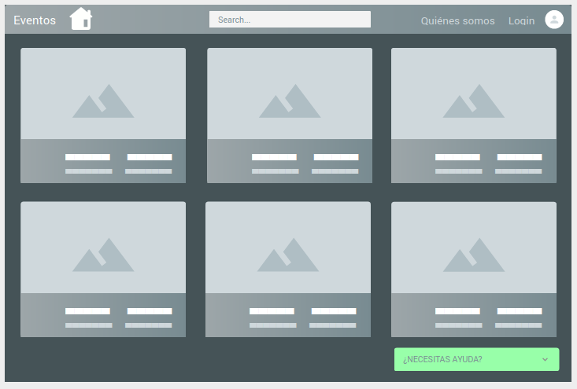

* Evento info

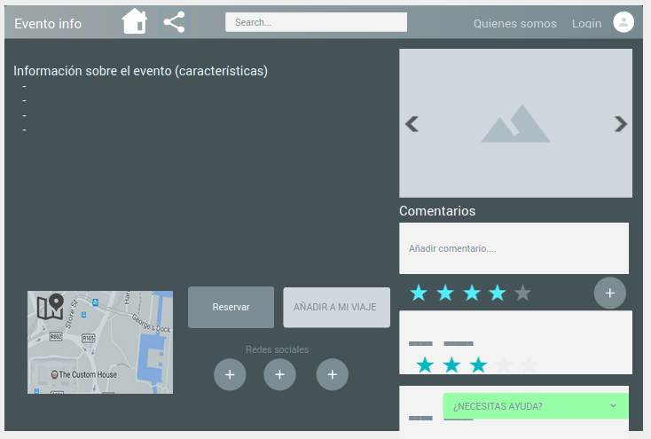

* Lugares de interés

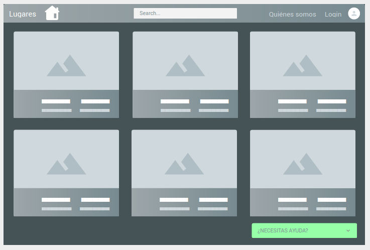

* Lugar info

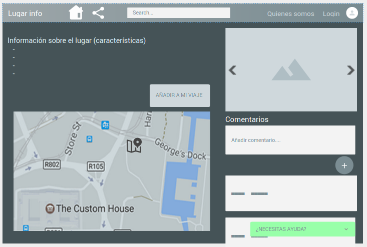

* Login

* Registro

* Perfil

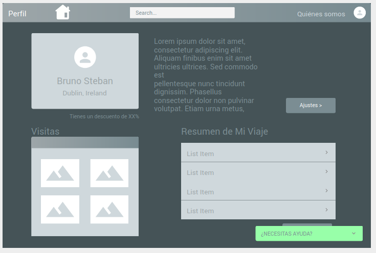

* Ajustes Cuenta

* Dar de baja

* Lista de viaje

* Quiénes Somos

* Contacto

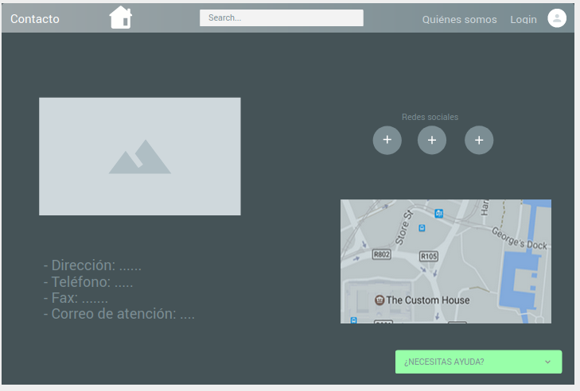

## Paso 3. Mi UX-Case Study (diseño)

 3.a Moodboard
-----

El logo se ha realizado con Wix. Puede usarse como imagen de perfil en las diferentes redes sociales, pero no como cabecera dada su resolución cuadrada.

  3.b Landing Page
----

 3.c Guidelines
----

En cuanto a las fuentes, hemos optado por Barlow. 
Se trata de un diseño sencillo y elegante, que utilizaremos en negrita e italic para resaltar la información más importante.

Los iconos son simples y muy facil de reconocer, para posibilitar el fácil uso de la aplicación y agrado.

En nuestro caso, hemos optado por una paleta con tonos marrones y pálidos, que recuerdan a los distintos tonos que puede tener la Alhambra de Granada, en sus diferentes zonas y con el paso de los años. 
La intención es la comodidad de los visitantes y el confort visual.

Por último, acomodamos estos factores al Logo de nuestra APP o Página, con un pequeño icono del Patio de los Arrayanes de la Alhambra de Granada.
Así se logra una conexión directa con la finalidad de la aplicación.

### Patrones UI
En cuanto a patrones se han diseñado páginas que cumplen con los siguientes:

- Login y Registro: Página inicial donde ha de registrarse con una red social ó iniciar sesión.
- Marcadores y favoritos: Posibilidad de añadir lugares a Mi lista de viaje.
- Detalles de contenido: Información específica de los lugares.
- Mapas: Localización detallada del lugar en cuestión.
- Sugerencias: Link a lugares recomendados.
- Comentarios: Posibilidad de escribir y leer comentarios.
- Información sobre la empresa: Información sobre la aplicación en cuestión en ¿Quiénes somos?
- Ayuda y retroalimentación: Añadido de ayuda en ¿Necesitas ayuda?
- Filtrar y ordenar: Filtro y ordenación de búsquedas.
- Perfil y cuenta: Perfil de usuario y ajustes de este.
- Compartir: Posibilidad de compartir los lugares.

  3.d Mockup
----

* Página de Inicio de Sesión y Registro

* Página principal

* Menú lateral desplegable

* Búsqueda 

* Página de ejemplo de sitio

 3.e ¿My UX-Case Study?
-----

La explicación se encuentra [aquí](https://www.youtube.com/watch?v=p9j3sk-qmlE).

## Paso 4. Evaluación 

 4.a Caso asignado
----

>>> Breve descripción del caso asignado con enlace a  su repositorio Github

 4.b User Testing
----

>>> Seleccione 4 personas ficticias. Exprese las ideas de posibles situaciones conflictivas de esa persona en las propuestas evaluadas. Asigne dos a Caso A y 2 al caso B
 

| Usuarios | Sexo/Edad     | Ocupación   |  Exp.TIC    | Personalidad | Plataforma | TestA/B
| ------------- | -------- | ----------- | ----------- | -----------  | ---------- | ----
| User1's name  | H / 18   | Estudiante  | Media       | Introvertido | Web.       | A 
| User2's name  | H / 18   | Estudiante  | Media       | Timido       | Web        | A 
| User3's name  | M / 35   | Abogado     | Baja        | Emocional    | móvil      | B 
| User4's name  | H / 18   | Estudiante  | Media       | Racional     | Web        | B 

. 4.c Cuestionario SUS
----

>>> Usaremos el **Cuestionario SUS** para valorar la satisfacción de cada usuario con el diseño (A/B) realizado. Para ello usamos la [hoja de cálculo](https://github.com/mgea/DIU19/blob/master/Cuestionario%20SUS%20DIU.xlsx) para calcular resultados sigiendo las pautas para usar la escala SUS e interpretar los resultados
http://usabilitygeek.com/how-to-use-the-system-usability-scale-sus-to-evaluate-the-usability-of-your-website/)
Para más información, consultar aquí sobre la [metodología SUS](https://cui.unige.ch/isi/icle-wiki/_media/ipm:test-suschapt.pdf)

>>> Adjuntar captura de imagen con los resultados + Valoración personal 

 4.d Usability Report
----

>> Añadir report de usabilidad para práctica B (la de los compañeros)

>>> Valoración personal 

## Paso 5. Evaluación de Accesibilidad  

  5.a Accesibility evaluation Report 
----

>>> Indica qué pretendes evaluar (de accesibilidad) sobre qué APP y qué resultados has obtenido 

>>> 5.a) Evaluación de la Accesibilidad (con simuladores o verificación de WACG) 
>>> 5.b) Uso de simuladores de accesibilidad 

>>> (uso de tabla de datos, indicar herramientas usadas) 

>>> 5.c Breve resumen del estudio de accesibilidad (de práctica 1) y puntos fuertes y de mejora de los criterios de accesibilidad de tu diseño propuesto en Práctica 4.

## Conclusión final / Valoración de las prácticas

>>> (90-150 palabras) Opinión del proceso de desarrollo de diseño siguiendo metodología UX y valoración (positiva /negativa) de los resultados obtenidos  

